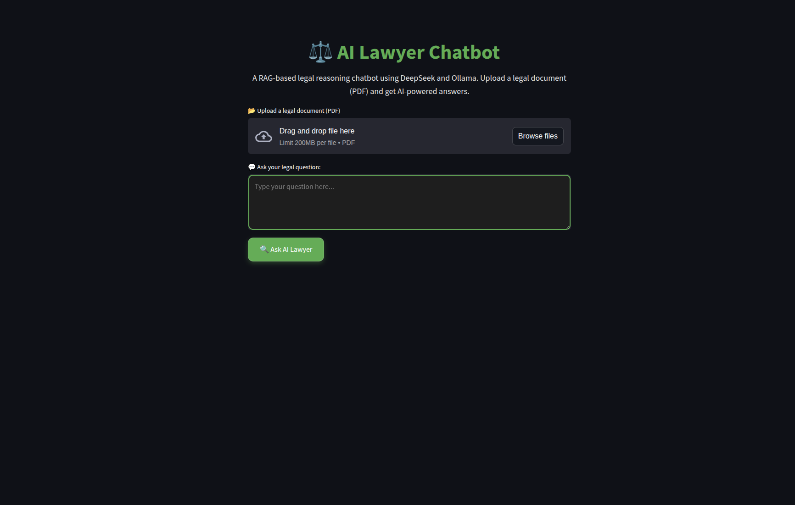
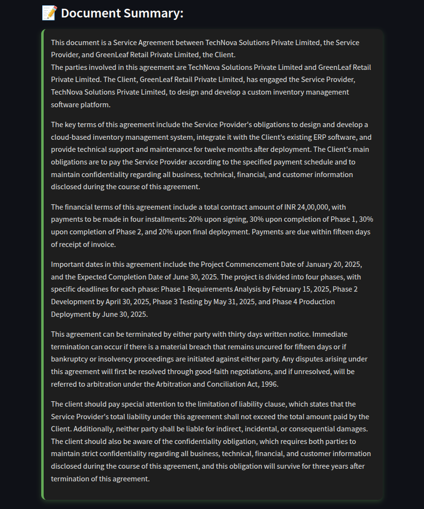
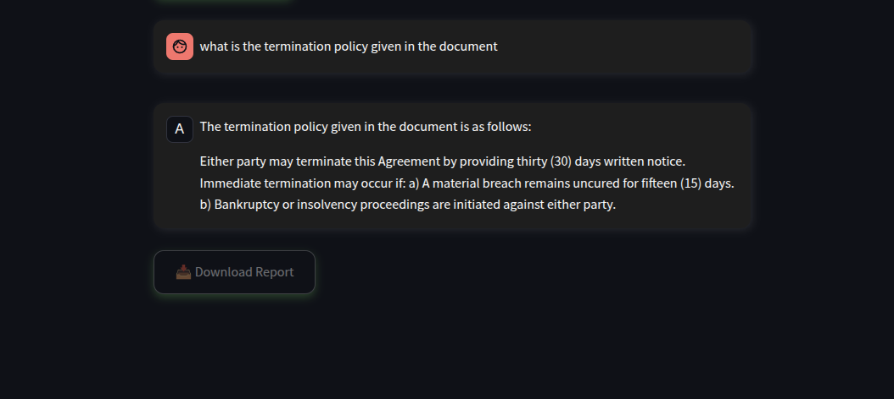
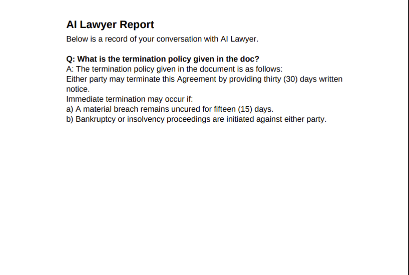

# ⚖️ AI Lawyer

AI Lawyer is a Retrieval-Augmented Generation (RAG) application designed to help users analyze legal documents, ask questions about uploaded files, generate document summaries, and create downloadable reports.

The system combines semantic document retrieval with a large language model to provide context-aware responses grounded in the uploaded legal documents.

---

## Overview

AI Lawyer enables users to:

* Upload legal documents in PDF format
* Ask questions about the uploaded document
* Retrieve relevant information using vector search
* Generate concise document summaries
* Export conversation reports as PDF files

---

## Screenshots

### Home Screen

<!-- Add screenshot here -->




### Document Summary

<!-- Add screenshot here -->




### Question Answering

<!-- Add screenshot here -->




### Generated Report

<!-- Add screenshot here -->




---

## Features

* PDF document upload and processing
* Retrieval-Augmented Generation (RAG)
* Context-aware legal question answering
* Legal document summarization
* Conversation history support
* Downloadable PDF reports
* FAISS vector database for semantic search
* Streamlit-based user interface

---

## Tech Stack

* Python
* Streamlit
* LangChain
* Groq API
* Llama 3.3 70B
* FAISS
* HuggingFace Embeddings
* ReportLab
* PDFPlumber

---

## Project Structure

```text
AI-Lawyer/
│
├── frontend.py
├── rag_pipeline.py
├── vector_database.py
├── requirements.txt
├── README.md
│
├── data/
├── uploads/
└── utils/
```

## Installation

### Clone the Repository

```bash
git clone <your-repository-url>
cd AI-Lawyer
```

### Create a Virtual Environment

```bash
python -m venv venv
```

Linux/macOS:

```bash
source venv/bin/activate
```

Windows:

```bash
venv\Scripts\activate
```

### Install Dependencies

```bash
pip install -r requirements.txt
```

### Configure Environment Variables

Create a `.env` file:

```env
GROQ_API_KEY=your_api_key_here
```

---

## Running the Application

```bash
streamlit run frontend.py
```

Open the URL displayed in the terminal.

---

## How It Works

1. User uploads a legal document.
2. Text is extracted from the document.
3. The document is split into chunks.
4. Embeddings are generated for each chunk.
5. FAISS indexes the embeddings.
6. Relevant chunks are retrieved for user queries.
7. The language model generates responses using retrieved context.
8. Users can summarize documents or download reports.

---

## Future Improvements

* Support for DOCX and TXT files
* Multi-document querying
* Citation-based responses
* Legal case law integration
* Improved summarization pipeline
* User authentication
* Conversation persistence

---

## Disclaimer

This project is intended for educational and research purposes only.

The responses generated by the application do not constitute legal advice. Users should consult a qualified legal professional for legal matters.

---

## License

Licensed under the Apache License 2.0.
